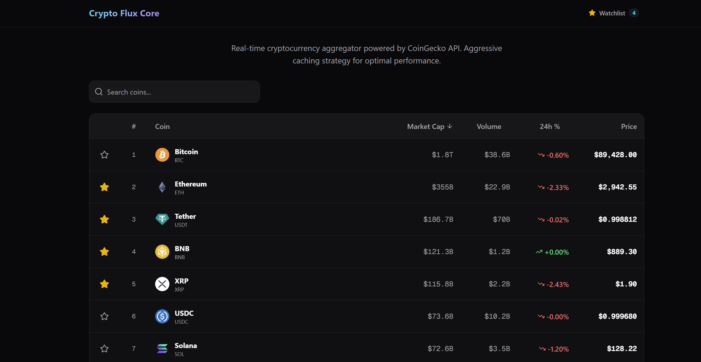

# 🪙 Crypto Flux Core

<div align="center">



### 🚀 Next-Gen Real-time Cryptocurrency Tracking Dashboard

<p>
  
  
  
  
</p>

</div>

---

## 📖 Introduction

**Crypto Flux Core** is a high-performance web application designed for real-time cryptocurrency monitoring. Built with the bleeding-edge **Next.js 16 App Router** and **React 19**, it delivers a seamless and lightning-fast user experience.

The project features a modern UI styled with **Tailwind CSS v4**, interactive charts powered by **Chart.js**, and a robust personalized watchlist system.

## ✨ Key Features

- **⚡ Real-time Market Data:** Live updates for cryptocurrency prices and market trends.
- **📊 Interactive Charts:** Dynamic price visualization using `react-chartjs-2`.
- **⭐ Smart Watchlist:** Persist your favorite coins and track them effortlessly (State Management).
- **🎨 Modern UI/UX:** Responsive design built with Tailwind CSS v4 and Lucide React icons.
- **🛣️ Dynamic Routing:** Optimized detailed pages for each individual cryptocurrency.

## 🛠️ Tech Stack

This project utilizes the latest bleeding-edge web technologies available in 2026.

<div align="center">

### Core Framework & Language
<p>
  
  
  
</p>

### Styling & Visualization
<p>
  
  
  
</p>

### Tools & Quality Control
<p>
  
  
  
</p>

</div>

## 🚀 Getting Started

Follow these steps to set up the project locally:

### 1. Clone the repository
```bash
git clone [https://github.com/DeiCroissant/crypto-flux-core.git](https://github.com/DeiCroissant/crypto-flux-core.git)
cd crypto-flux-core

2. Install dependencies
npm install
# or
yarn install

3. Run the development server
npm run dev

Open http://localhost:3000 with your browser to see the result.